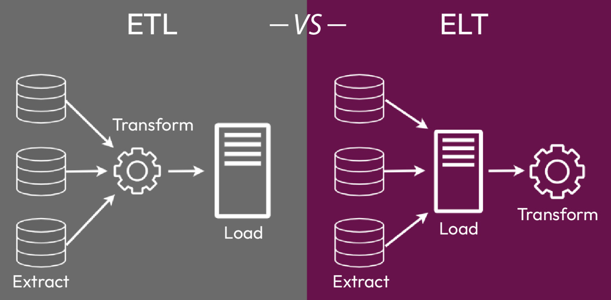

# ETL-Python
 - Um pipeline de dados robusto deve ter expectativas claramente definidas em termos dos dados que está a processar e dos resultados que se espera que produza.
 - Isso inclui a especificação dos tipos e fontes de dados, bem como o formato de saída desejado e quaisquer transformações ou agragrações necessária.
 - Álem de uma Expectativa bem definida um pipeline de dados robusto deve ter uma arquitetura escalável que possa lidar com volumes crescentes de dados sem degradação do desempenho.

# Pré-Trabalho- Entendendo seus dados

 >        Seus Dados são a sua Base.
  
 O contexto e o fluxo do pipeline é sobre esse contexto. Como projetista do pipeline, é melhor familiarizar-se intimamente com os requisitos da estrutura de dados de entrada e saída.
 
#### Dados de Entrada : 
     
Você deve escrever definições claras dos dados de entrada, tais como suas estruturas de dado, a prevalência de dados corrompidos e a frequência de criação de novos dados. Qual é a probabilidade de corrupção de dados e como isso pode ser contabilizado no pipeline?

#### Dados de Saída :

É importante ter uma compreensão completa dos requisitos estruturais dos dados de saída para garantir que os objetivos do projeto sejam consistentemente mantidos durante a sua concepção e construçã. Um pipeline fraco é problematico, mas um pipeline que não serve para nada é pior.

# O que é um pipeline de dados ETL ?

**ETL**   Significa  **EXTRACT**, **TRANSFORMAR**, **CARREGAR**. Em um processo ETL, os dados são primeiro extraídos de uma fonte, depois transformados e formatados de uma maneira específica e, finalmente, carregados em um local de armazenamento final. 
Esses  pipelines são úteis para organizar e preparar dados para fins futuros, como realizar análises e criar modelos de maneira suave e eficiente.

#### e o ELT?

Significa **Extract**,**LOAD** E **TRANSFORM**,e é semelhante ao ETL, mas os dados são primeiro carregados no sistema de destino e depois transformados dentro do sistema de destino.

# Então, qual dessas soluções devo utilizar?

> Depende dos Requisitos e características específicas dos sistemas envolvidos e dos dados movimentados.

#### Aqui estão alguns fatores que devem ser considerados ao decidir entre **ETL** e o **ELT**:

- ###  Volume de Dados: 
Se o volume de dados for muito grande, o ETL pode se r mais eficiente por que a etapa de transformação pode ser feita em paralelo dentro do sistema Alvo.

- ### Requisitos de Transformação de dados: 
 Se os dados precisarem passar por transformações complexas, pode ser mais fácil realizar as transformações no sistema de destino usando ELT.

- ### Capacidades do sistema de origem: 
 se o sistema de origem não for capaz de realizar as transformações necessárias, o **ETL** pode ser a única opção.

- ### Capacidades do Sistema de destino: 
Se o sistema de destino não for capaz de lidar com eficiência com fase de carga do processo ETL, o ELT pode ser uma opção melhor.

- ### Latência de dados : 
Se for necessária movimentação de dados em tempo real, o **ELT** pode ser uma melhor Escolha, porque permite que os dados sejam carregados e transformados mais rapidamente.

##### Em resumo O ETL é mais comumente usado quando os sistemas de origem e de destino são diferentes e os dados precisam ser transformados de uma maneira específica antes de serem carregados no sistema de destino.
#### **ELT** É mais comumente usado quando o sistema alvo é mais poderoso e pode lidar com a etapa de transformação. 

